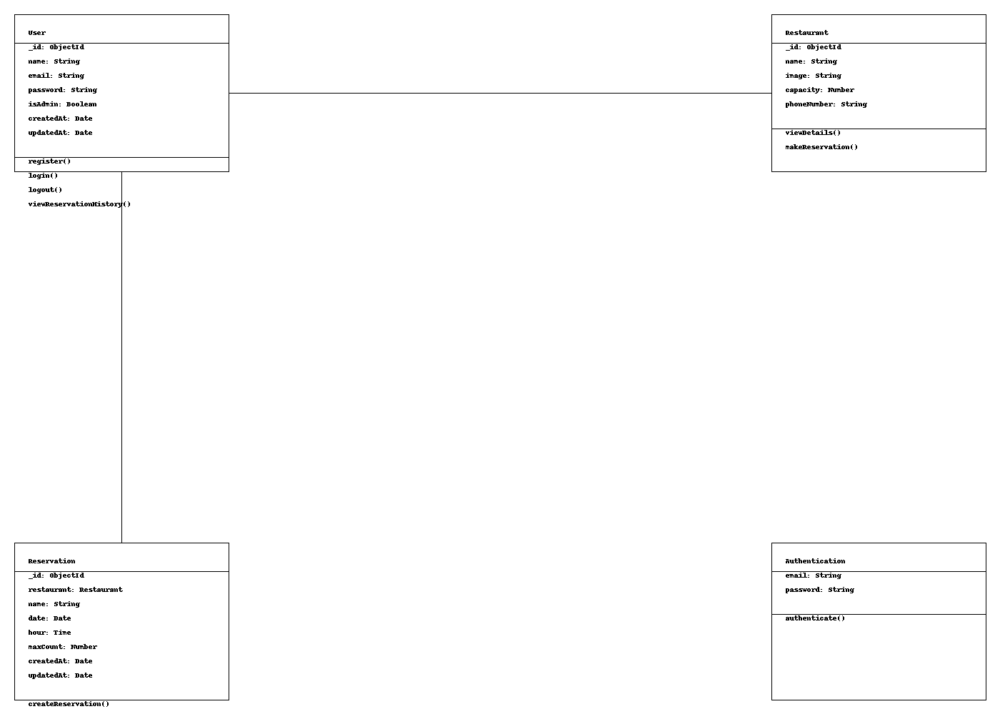

### Valence Reserve: Restaurant Reservation App

#### Team Members:
- Mitrana Florin Fanel ([florinmitrana](https://github.com/florinmitrana))
- Ditoiu Andrei Adelin ([dixi-andrei](https://github.com/dixi-andrei))
- Ionascu Dragos Adrian ([dragoshenko](https://github.com/dragoshenko))

### Project Description

This project is a web application that allows users to make reservations at various restaurants. The application is built using React for the frontend and Node.js for the backend.

### Features
- View all restaurants
- View details of a specific restaurant
- Make a reservation at a restaurant
- Reservation history
- Make a reservation with a calendar

### UML

### Minimum requirements
- Resolved -> [Wiki](https://github.com/florinmitrana/MDS-Project/wiki/Wiki)

### Demo video

[demo](https://www.youtube.com/watch?v=u53mRT3PeSs)
